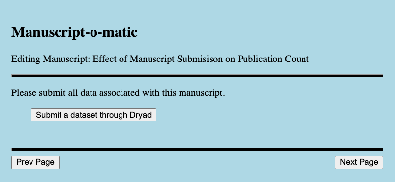
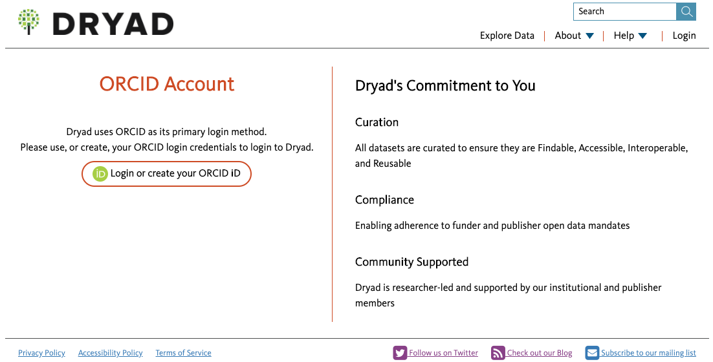
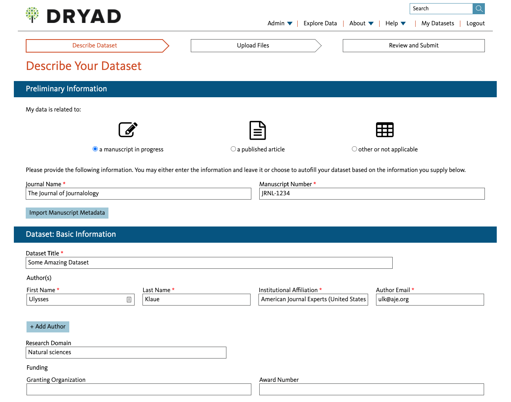
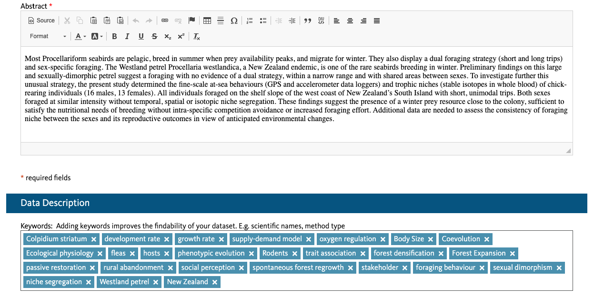
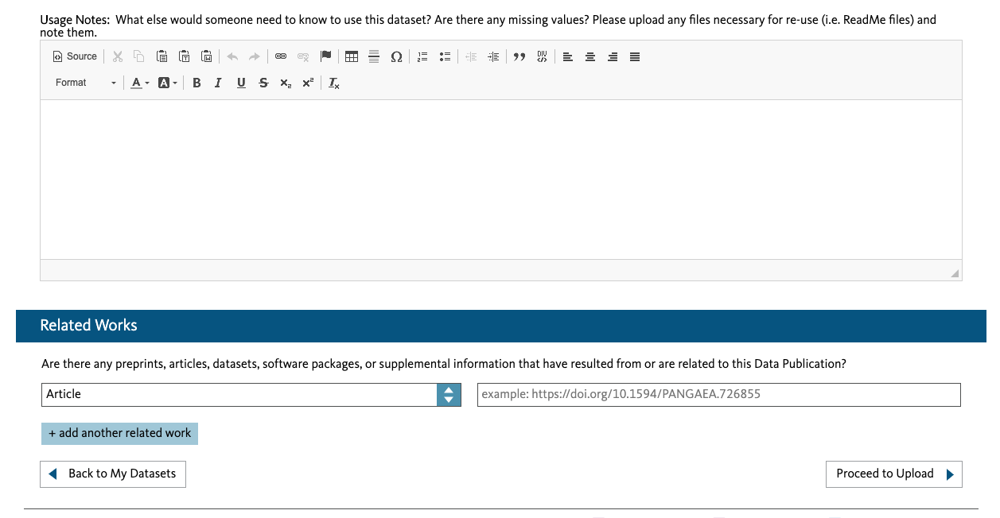
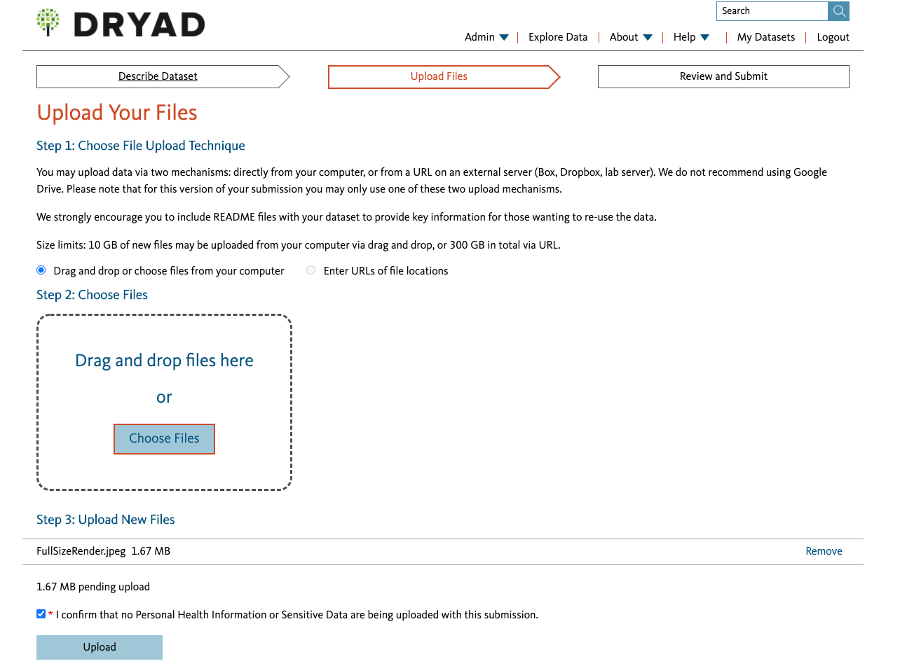
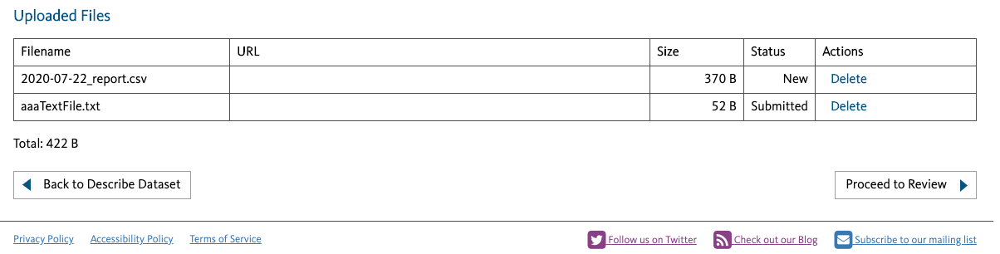
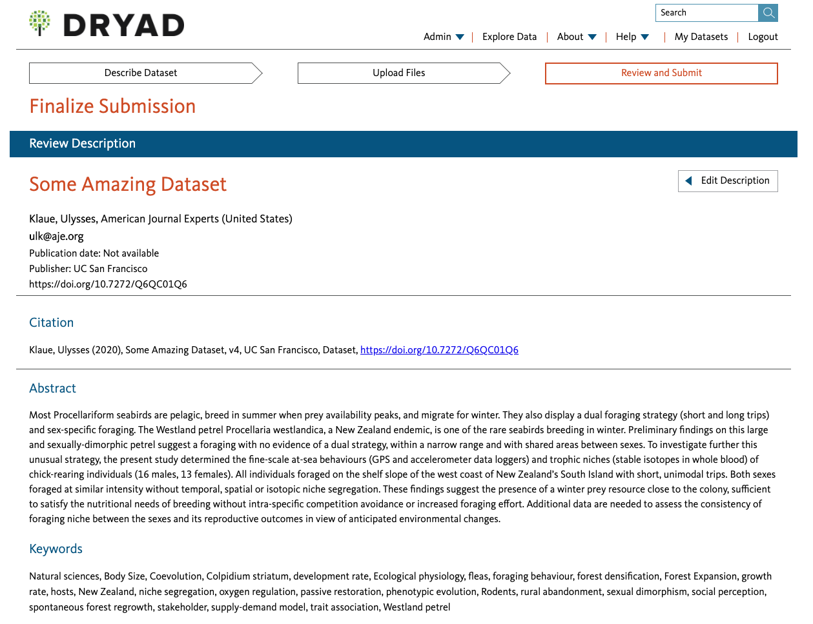
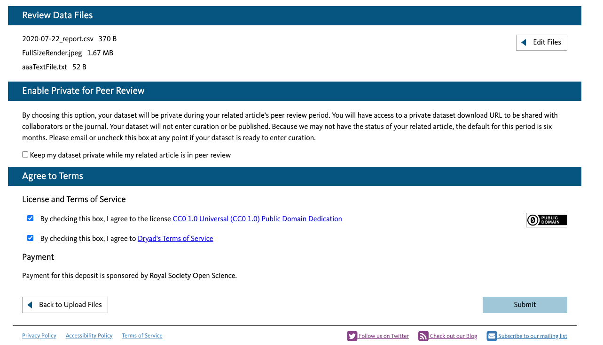
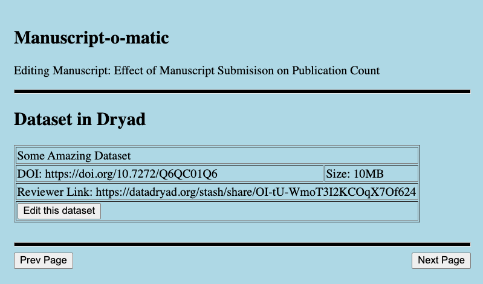

Dryad Embedded Submission: Author Experience
============================================

This document describes options for an author’s experience when
interacting with a manuscript system that has “embedded” Dryad
functionality.

The user starts in the manuscript system, on a page that contains a
section like this:

When the user clicks the button “Submit Data to Dryad”, the Dryad
submission process will open, and the user will be asked to login to
Dryad, using their ORCID.

If they had already been logged in to the ORCID system, they will go
directly to the submission page (below). If not, they will be
redirected to the ORCID website to login, and then to the submission
page.

The user will then see metadata that was pre-populated in their Dryad
submission, which the journal sent behind the scenes. They will be
able to modify and expand this metadata.

The user will then proceed to uploading files.

Once files are uploaded, the user will review their dataset details
and accept Dryad’s license terms.

When the submission is completed, the user will be redirected back to
the manuscript system to continue their manuscript submission.

