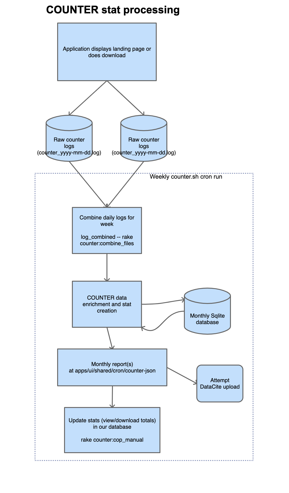

# Overview of the COUNTER stats

The [COUNTER Code of Practice for Research Data](https://www.projectcounter.org/wp-content/uploads/2019/02/Research_Data_20190227.pdf)
allows view (investigations) and download (request) statistics to be calculated in a uniform
way across different repositories.  It has specific technical requirements for how items are counted.

## How stats are created

- Counter Stats are logged on page view and downloads and written to log files (two servers).
- Logs are processed each week
  - Logs are combined
  - The Python Counter Processor does the work of massaging and creating stats.
    - It enhances data with hit type (investigation/request),
      geolocation country data based on IP Address.
    - It filters out double-clicks in a short time and adds session tracking and classifies as likely
      human/robot/machine (based on user-agent strings and a list).
    - It adds stats into a monthly sqlite DB for tracking all the requests.  Only new
      items since last run are fed into the database.
  - Counter stat processing per dataset, classifies
    - Total investigations
    - Unique investigations
    - Total requests
    - Unique requests
    - For each country (number/size) and also totals for all
    - "Unique" stats only count an item within an hour time slice and uniqueness is determined by a special
      session ID which uses one of 4 different metrics (user id, cookie id, session cookie id, ip address ).
  - It produces a JSON report (see `apps/ui/shared/cron/counter-json`).
  - It attempts uploading to DataCite reporting interface (large compressed format upload must be used).
  - Report is saved to our file system and we have our own script that tallies all the reports each week
    and saves total numbers into our database.

## How views and downloads are shown

Currently the numbers of views and downloads are processed into our database each week
(`stash_engine_counter_stats`).  Because *requests* (downloads) are also counted as *investigations*
according to the COUNTER spec the numbers that
display on the page for views is less than shown in the database ( `views = investigations - requests`).

## The alternate way to get stats from DataCite

Formerly, we used the DataCite EventData API to retrieve the stats we had submitted to them.
EventData uses a triple-store (RDF) type of query to retrieve results that
meet certain criteria.  We moved away from using EventData in order to maintain better speed and
availability for these statistics and we already have all these statistics in our own
json files that we've previously calculated ourselves.

DataCite was engaged in an initiative to restructure and ease COUNTER stat submission
and calculation in 2022.  We've begun tracking page views by adding javascript to our
landing pages which is tracked at `plausible.io`.  We need to do some additional
work with DataCite to add tracking for downloads as they continue further
development on their new project.

It's likely that the new product manager for Dryad will
need to re-engage discussions with DataCite in order to complete testing and transition
to their new way of working with COUNTER stats.

## How long before stats update?

Stats should be expected to take some time to update, especially for end-of-the-month
reporting.

- **Reporting runs once a week and takes from a few hours to *a week* or more to run** for
  calculating stats. Reworking this to be faster isn't a big priority since our current reporting
  will be replaced by the new DataCite (`plausible.io`) initiative mentioned above.
- End-of-month reports are typically interrupted by server reboots and maintenance the first
  Tuesday of the month so the **reports for the past month may not complete until a couple of
  weeks into the new month**.
- People may also have incorrect expectations of "views" and "downloads."
  An author viewing their landing page from once computer 1,000 times in an hour only
  counts as 1 view, for example.  These stats mean very specific things according to the
  COUNTER Code of Practice and users may have incorrect expectations.

# Overview of citations

DataCite is in a unique position to track citations since most journal and data publications
go through their platform and supply metadata to them. DataCite supplies a service for tracking
citations from one work to another using their EventData API which allows querying
relationships between works. CrossRef also offers a similar
service, though we were assured by DataCite that their service tracks the same citations
that would be available through CrossRef.  We found DataCite's uptime, stability and API throttling to
be significantly better than what we experienced with CrossRef.

We are using the DataCite EventData API to obtain information about works related to each other through
DOIs and the metadata registered.

## The process of obtaining new citations

- We check DataCite EventData for new citations on a weekly basis. (`rails counter:populate_citations`)
- Citations from DataCite are cached into our database using the `CounterCitation` class to make them
  quickly available instead of making landing page loads slower or more unreliable while we check
  the EventData API.
- When a new dataset is published or embargoed (metadata released), citations from EventData are
  populated with the weekly run.
- Existing datasets that have been checked for citations get checked again for new citations
  after 30 days have elapsed since the last check.  Although checks run weekly, not every dataset is checked
  every week.  A large number of datasets have citations that change little from one week to the 
  next and checking every dataset for new citations weekly is very time consuming since we adhere
  to API throttling limits rather than slamming DataCite EventData with queries.

## My dataset is missing citations.  What's going on?

- When did the related work appear? It may take some time for the related work to appear,
  especially for old datasets. Expect it taking up to a month to appear in some cases currently.
- We can verify that our weekly checks for new citations are running (this has generally been
  reliable and not a large problem).
- Please let us know **specifics** about the citation that should appear for your related work
  in order to facilitate a fix. Information is power.
  - When was the citation made?
  - What is the DOI of the work that cites your dataset?
  - We can verify that the other work cited your dataset properly and that our query to
    DataCite EventData ought to return that work.
  - When we believe other reasons for the citation not appearing have been eliminated then
    we can contact DataCite to find out why the citation was not included in EventData or to
    ask them to look into any issues.
