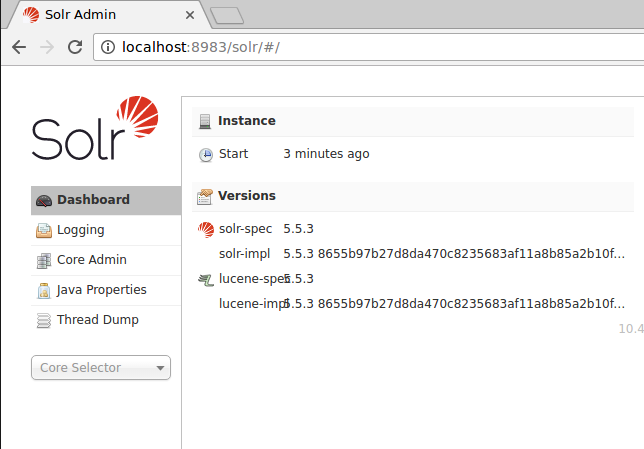
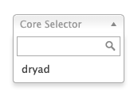
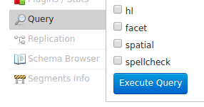
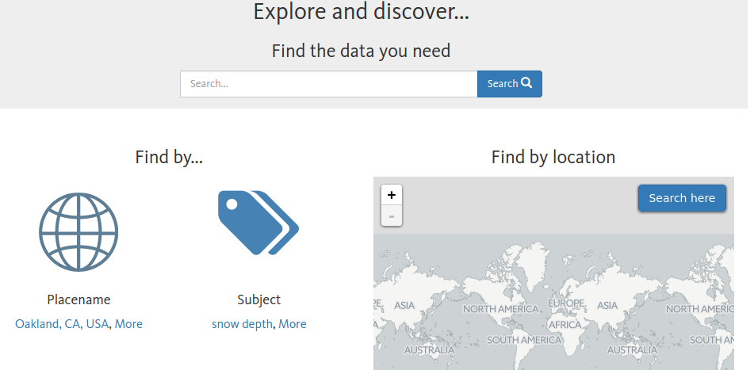
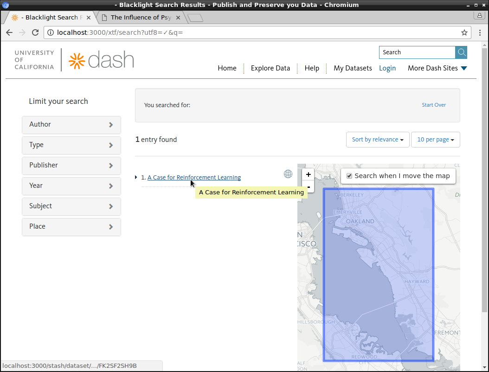
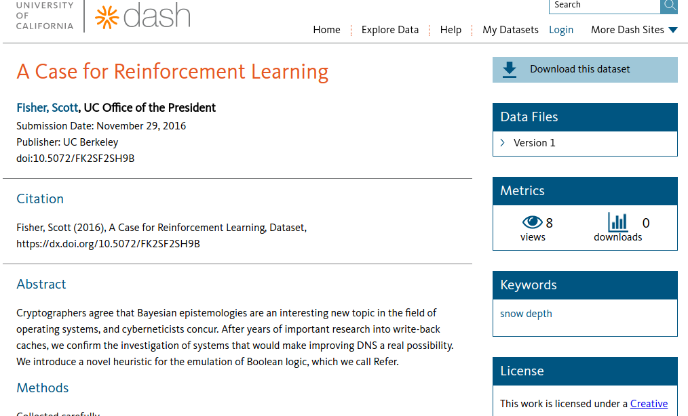

# Dryad installation (v0.0.2)

The Dryad application is made of a number of parts intended to keep it more flexible and to separate concerns so that parts can be replaced with new metadata and other engines to customize it.  Some basic information about the project and architechiture is available at [the Dryad Platform](https://datadryad.org/stash/our_platform), but this document focuses on getting Dryad up and running for development.

## The ingredients

You'll need the following parts installed and configured on a (local) UI development server to do development on the full UI application.  Don't worry, there are more detailed installation instructions in other sections below and this is meant to give an overview of the larger dependencies to configure.

- (Recommended) A ruby version manager such as [rbenv](https://github.com/rbenv/rbenv) or [rvm](https://rvm.io/)
- The [bare Dryad application](https://github.com/CDL-Dryad/dryad-app) cloned from github

You'll also need the following components installed either on the same server or on separate servers for all the application features to work:

- MySQL (with the database specified in the database.yml created and using utf8mb4 character set by default)
- SOLR (with a geoblacklight schema and core installed)
- A storage repository that supports SWORD will be needed to submit documents to the repository and even with SWORD support, the code may need some customization for others besides the Merritt repository.
- A DOI minting service such as EZID to mint DOIs.

The application also requires some means to log in outside of a development environment. You'd want to configure a log in method for each application tenant from these:

- Google login
- Shibboleth login
- ORCID login (coming soon and required for ORCID lookup in the metadata page)

## Installing the code and a base config

Open a (bash) shell and type these commands inside a directory where you want to work with this code. These will clone the development code and an example config.

```
git clone https://github.com/CDL-Dryad/dryad-app
```

You should end up with a directory structure that looks like this one.

```
├── dryad
|   ├── config
|   └── dryad-config-example
└── stash
    ├── stash-harvester
    ├── stash-merritt
`    ├── stash-deposit
    ├── stash-wrapper
    ├── stash_datacite
    ├── stash_discovery
    └── stash_engine
```

Most of the configuration can be left as default. Items to check before first launch:
1. config/database.yml
2. config/app_config.yml, particularly the ORCID key and secret

## Installing MySQL and Solr

### MySQL

*MySQL must be at least version 5.7*

The procedure to install MySQL and Solr vary from one operating system to another, but this guide shows a way to configure it in Ubuntu linux:

```
# installing MySQL in an Ubuntu Linux distro, make note of the root password you set while installing
sudo apt-get install mysql-server mysql-client libmysqlclient-dev

# make sure MySQL is started
sudo service mysql start

# connect to mysql, note the <username> is probably root in a new installation, and the password is probably blank
mysql -u <username> -p

# if the above doesn't work, try
sudo mysql -u root


# create the dash database
CREATE DATABASE dryad CHARACTER SET utf8mb4 COLLATE utf8mb4_unicode_ci;

# add a user to the database
CREATE USER 'travis'@'%';

# grant the user privileges
GRANT ALL PRIVILEGES ON dryad . * TO 'travis'@'%';
FLUSH PRIVILEGES;

# ensure all rails migrations can be applied
set global log_bin_trust_function_creators=1;

# To exit the MySQL client, type *exit* or press ctrl-d

```

Now edit the config/database.yml file to fill in the user and password you set above in the development environment for that configuration file. (For a local database install, you should not need to change anything.)

### Solr
Solr requires a Java runtime.  Try *java -version* and if it says that "java can be found in the following packages" rather than giving you a version you probably need to install java with a command like *sudo apt-get install default-jre* .

[See the SOLR cofiguration README for detailed SOLR install information](../config/solr_config/README.md)


<br>Make sure Solr is working by going to  [http://localhost:8983](http://localhost:8983). You should see a Solr admin page.



Verify Solr is set up correctly from the Admin UI:

1. Choose the geoblacklight core from the core selector list.<br>

2. You can then click the *query* sidebar tab and scroll down to the bottom of the form to submit a blank query.  While the document will not return any results yet because there are no documents in SOLR, you should see it execute and you can verify that Solr queries are running.<br>

## Getting the Rails application running

I'd *strongly* recommend installing [rbenv](https://github.com/rbenv/rbenv) for a local development environment as a way to manage Ruby versions.  Follow the installation instructions given on the rbenv site to install it, but make sure the `rbenv init` command is run in every shell (e.g., add it to .bashrc). Install the [Ruby build plugin](https://github.com/rbenv/ruby-build#readme) to make it easy to install different Ruby versions as needed.

```
# make sure some basic libraries are installed that are probably required later (Ubuntu example)
sudo apt-get install libxml2 libxml2-dev patch curl build-essential libreadline-dev

cd dryad-app
rbenv install $(cat .ruby-version) # installs the ruby-version set in the .ruby-version file

# update your rubygems version
gem update --system

# install bundler to handle gem dependencies
gem install bundler:2.2.27
```

**If you are running on OSX, ensure some gems are compatible with the system:**
```
brew install shared-mime-info
xcode-select --install
gem install libv8 -v '3.16.14.19' -- --with-system-v8
gem install therubyracer -v '0.12.3' -- --with-v8-dir=/usr/local/opt/v8@3.15
gem install mysql2 -v '0.5.3' -- --with-ldflags=-L/usr/local/opt/openssl/lib --with-cppflags=-I/usr/local/opt/openssl/include
```

For all operating systems, continue...
In a system startup script such as `.bash_profile`, add the
environment variable `RAILS_ENV`. This specifies the Rails "environment" or set
of configuration values. For most installations, the value will be `local`.

Encrypted credentials: Many of Dryad's configuration files read
credentials from the Rails credentials file. Before Rails will run, you must do
one of two steps:
- (for Dryad development team) Obtain the credentials encryption key from a Dryad developer and place it in `config/master.key`
- (for non-Dryad users of the code) In all files `config/*.yml`, replace the `Rails.application.credentials`
  statements with your own credentials.


```
export RAILS_ENV=local
```

```
# now install the gem libraries needed for the application
bundle install

# exit the shell and re-enter, so the environment can pick up the latest changes

# run the migrations to set up the database tables
rails db:migrate

# start your rails server for local development
rails s
```

## User interface components

Some portions of Dryad's interface rely on Node and React. See the [Node Installation](node_npm_server_install.md) instructions.

Dryad's submission system validates files with the Frictionless Data
toolkit. The [Frictionless
Installation](frictionless_integration/INSTALL.md) instructions are deprecated since it uses an
AWS Lambda for validating files.  The [implementation overview](frictionless_integration/implementation_overview.md) 
gives a few details.  In order to get your local server to work with the callbacks, you'll need to have them
publicly accessible and create an environment with the correct domain name or use an environment that uses
our dev database.  To mock the functionality, you could manually
insert a validation report into the stash_engine_frictionless_reports table to examine UI elements.

## Final search configuration

To configure where the search interface draws its
data from, modify the `config/blacklight.yml` to change the endpoint for the
development server.  When running locally, the default server is the Dryad
development server, but it can be overridden with the `SOLR_URL` environment
variable.


## Upload configuration

When users upload files, they are sent to a temporary holding location in Amazon
S3. Dryad maintains S3 buckets for each Rails environment setting. If you are
using `RAILS_ENV=local`, the bucket will be the "dev" bucket.

In order to upload files, login to S3 and ensure that the bucket's Permissions
allow uploads from the server you are using. 

## Merritt connection

If your server is outside the UC environment, you will need to use a proxy to
communicate with the Merritt servers that are inside the UC environment.

Set up [SSHuttle](technical_notes/sshuttle_README.md) to connect with Merritt.

## Testing basic functionality

### Explore the datasets
Open your web browser and go to [http://localhost:3000](http://localhost:3000) to see the homepage.

The *Explore data* link will allow you to search and view your dataset, if you imported a sample record.

<br><br>
<br><br>


### Enter dataset metadata, upload files and preview the landing page

After you log in, you will be able to start entering metadata and uploading files for a dataset by clicking the *My datasets* menu link.

Metadata entry, file uploading and landing page preview should be functional.

We have enabled submission to a SWORD-enabled Merritt repository, but have only implemented relevant parts of the SWORD specification and not every functionality in the specification has been implemented.

## Next steps in configuration

### Repository and identifier service configuration

The Stash platform requires an implementation of the [Stash::Repo](../stash)
API for identifier assignment and submission to repositories.

Dryad uses CDL's EZID service for identifier assignment and stores datasets in the [Merritt](https://merritt.cdlib.org/) repository.
The Stash::Repo implementation is provided by the [stash-merritt](../stash/stash-merritt) gem, which is included in the application [Gemfile](../Gemfile) and declared by the `repository:` key in [`app_config.yml`](../dryad-config-example/app_config.yml).
EZID and Merritt/SWORD must be configured for each tenant in the appropriate `tenants/*.yml` file, e.g.

```yaml
repository: # change me: you'll probably have to change all the following indented values and only if using Merritt repo
    type: merritt
    domain: http://merritt-repo-dev-example.cdlib.org
    endpoint: "http://uc3-mrtsword-dev.cdlib.org:39001/mrtsword/collection/my_collection_id"
    username: "submitter_username"
    password: "submitter_password"
 identifier_service: # change me: the identifier service is EZID here, may need to change this
    shoulder: "doi:10.5072/FK2"
    account: my_account_name
    password: my_account_password
    id_scheme: doi
    owner: null
```

### Make NIH have sub-funders
Type 

```
RAILS_ENV=production rails funders:set_nih
```

which makes the rails database have a special structure for NIH to include sub-funders.  Other
umbrella funders may be added later.
  
'op '

### Connection to Dryad machines in the UC infrastructure

If you are connecting your Dryad installation to any services in the UC
computing system, you will need to create proxied connections using a service
such as sshuttle. Instructions and a useful script can be found in the
[config/script](../config/script) directory.
