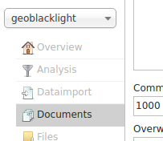
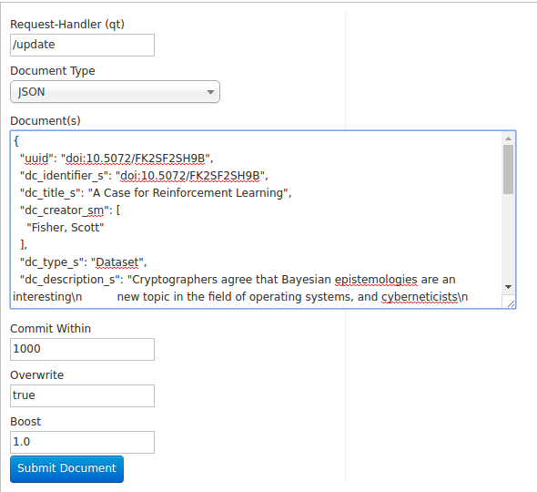
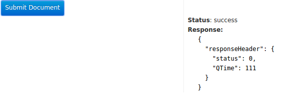
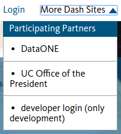
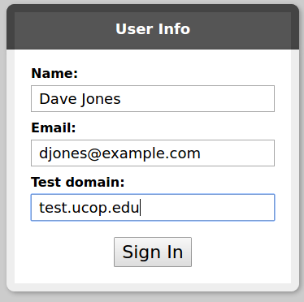

# Dryad installation (v0.0.2)

The Dryad application is made of a number of parts intended to keep it more flexible and to separate concerns so that parts can be replaced with new metadata and other engines to customize it.  Some basic information about the project and architechiture is available at [the Dash Website](https://dash.ucop.edu/stash/about), but this document focuses on getting Dash up and running for development.

## The ingredients

You'll need the following parts installed and configured on a (local) UI development server to do development on the full UI application.  Don't worry, there are more detailed installation instructions in other sections below and this is meant to give an overview of the larger dependencies to configure.

- (Recommended) A ruby version manager such as [rbenv](https://github.com/rbenv/rbenv) or [rvm](https://rvm.io/)
- The [bare Dryad application](https://github.com/CDL-Dryad/dryad) cloned from github
- The [stash](https://github.com/CDL-Dryad/stash) repository cloned from github

You'll also need the following components installed either on the same server or on separate servers for all the application features to work:

- MySQL (with the database specified in the database.yml created and using utf8mb4 character set by default)
- SOLR (with a geoblacklight schema and core installed)
- A storage repository that supports SWORD will be needed to submit documents to the repository and even with SWORD support, the code may need some customization for others besides the Merritt repository.
- A DOI minting service such as EZID to mint DOIs.

The application also requires some means to log in outside of a development environment. You'd want to configure a log in method for each application tenant from these:

- Google login
- Shibboleth login
- ORCID login (coming soon and required for ORCID lookup in the metadata page)

## Installing the code and a base config

Open a (bash) shell and type these commands inside a directory where you want to work with this code. These will clone the development code and an example config.

```
git clone https://github.com/CDL-Dryad/dryad
git clone https://github.com/CDL-Dryad/stash
```

You should end up with a directory structure that looks like this one.

```
├── dryad-config
├── dryad
└── stash
    ├── stash-harvester
    ├── stash-merritt
    ├── stash-sword
    ├── stash-wrapper
    ├── stash_datacite
    ├── stash_discovery
    └── stash_engine
```

Your config files are currently in a seperate directory from your application. It can be handy to keep them apart from the application so that you can back them up or commit them to a private repository for configuration separate from the application.  The application will need to have these configuration files symlinked into the application. to symlink the files in using a bash shell, type these commands:

```
cd dryad
./symlink_config.sh
```

After you add or remove any configuration file, such as a yml file in the tenants directory, you will want to run the script above again update symlinks to config in the application.

## Installing MySQL and Solr
### MySQL

The procedure to install MySQL and Solr vary from one operating system to another, but this guide shows a way to configure it in Ubuntu linux:

```
# installing MySQL in an Ubuntu Linux distro, make note of the root password you set while installing
sudo apt-get install mysql-server mysql-client libmysqlclient-dev

# make sure MySQL is started
sudo service mysql start

# connect to mysql, note the <username> is probably root in a new installation
mysql -u <username> -p

# if the above doesn't work, try
sudo mysql -u root

# create the dash database
CREATE DATABASE dash CHARACTER SET utf8mb4 COLLATE utf8mb4_unicode_ci;

# add a user to the database
CREATE USER 'dashuser'@'%' IDENTIFIED BY '<my-password>';

# grant the user privileges on dash database
GRANT ALL PRIVILEGES ON dash . * TO 'dashuser'@'%';
FLUSH PRIVILEGES;

# To exit the MySQL client, type *exit* or press ctrl-d

```

Now edit the dryad-config/config/database.yml file to fill in the *dashuser* and password you set above in the development environment for that configuration file.

### Solr
Solr requires a Java runtime.  Try *java -version* and if it says that "java can be found in the following packages" rather than giving you a version you probably need to install java with a command like *sudo apt-get install default-jre* .

```
# Download Solr using wget
wget http://archive.apache.org/dist/lucene/solr/5.5.3/solr-5.5.3.tgz

# Extract the Solr files to a directory without the version in the name
mkdir -p solr && tar zxvf solr-5.5.3.tgz -C solr --strip 1

cd solr

# start Solr with this command, you can stop it later by using stop instead of start
bin/solr start

# create the geoblacklight core
bin/solr create -c geoblacklight

# download and copy the geoblacklight schema to the core
mkdir tmp && cd tmp
wget -L https://github.com/geoblacklight/geoblacklight-schema/archive/v0.3.2.tar.gz
tar zxvf v0.3.2.tar.gz
cp geoblacklight-schema-0.3.2/conf/* ../server/solr/geoblacklight/conf

# restart the Solr server
cd .. && bin/solr restart
```
<br>Make sure Solr is working by going to  [http://localhost:8983](http://localhost:8983). You should see a Solr admin page.


Verify Solr is set up correctly from the Admin UI:

1. Choose the geoblacklight core from the core selector list.<br>

2. You can then click the *query* sidebar tab and scroll down to the bottom of the form to submit a blank query.  While the document will not return any results yet because there are no documents in SOLR, you should see it execute and you can verify that Solr queries are running.<br>

<br>(Optional, but recommended) Add a sample record to match the sample database record (see below).

1. Click the *Documents* tab on the left side.<br>

2. Find the file *dryad-config/sample\_data/sample\_record.json* in the dryad-config repo.  Open the file in a text editor, select all the text and copy it.

3. Paste the text into the *Document(s)* box on the page.<br>
4. Click *Submit Document* and be sure it shows a status of success.<br>

## Getting the Rails application running

I'd *strongly* recommend installing [rbenv](https://github.com/rbenv/rbenv) for a local development asenvironment as a way to manage Ruby versions.  Follow the installation instructions given on the rbenv site to install it, but make sure the `rbenv init` command is run in every shell (e.g., add it to .bashrc). Install the [Ruby build plugin](https://github.com/rbenv/ruby-build#readme) to make it easy to install different Ruby versions as needed.

*Note for OSX:* Ensure the command-line XCode utilities are installed. `xcode-select --install`

```
# make sure some basic libraries are installed that are probably required later (Ubuntu example)
sudo apt-get install libxml2 libxml2-dev patch curl

cd dryad
rbenv install $(cat .ruby-version) # installs the ruby-version set in the .ruby-version file

# update your rubygems version
gem update --system

# install bundler to handle gem dependencies
gem install bundler

# now install the gem libraries needed for the application
bundle install

# run the migrations to set up the database tables
bundle exec rake db:migrate

# start your rails server for local development
rails s
```

If you want to view sample data, then insert a sample record into the database (recommended).

```
# connect to mysql, note the <username> is probably root in a new installation
mysql -u <username> -p

# Use the following two lines.
USE dash;
source ../dryad-config/sample_data/sample_record.sql;

# To exit the MySQL client, type *exit* or press ctrl-d
```

To configure where the search enterface draws its data from, modify the dryad app config/blacklight.yml to change the endpoint for the development server.  When running locally, the default server is development.

## Testing basic functionality

### Explore the datasets
Open your web browser and go to [http://localhost:3000](http://localhost:3000) to see the homepage.

The *Explore Data* link will allow you to search and view your dataset, if you imported a sample record.

<br><br>
<br><br>


### Use the developer login

Until a tenant is configured and login methods are set up you can use the developer login to access password protected parts of the application for testing or development. The developer login is only available in the development and test environments and is a useful way to test functionality and tenant configuration without having to have a new domain name registered for each tenant (very useful on a local or development machine).  It is also useful for pre-testing a tenant and submitting test records for that tenant into a repository without having to obtain an account for the authentication method (such as Shibboleth with a campus account) that a tenant normally uses.

To use the developer login:

1. Click the *More Dash Sites* drop-down menu and then click *developer login (only development)*.<br><br><br>
2. In the login screen enter a name, email address and a domain name.  The domain name should allow the *domain_regex* regular expression from one of your tenant configurations to match the string you enter as the test domain.<br>.
3. Until you log in again or your cookies expire, the user interface will display items specific to the tenant you entered the domain name for (such as the logo, help and other things configured for that tenant). It will also act as that tenant when submitting data to a configured repository.

### Enter dataset metadata, upload files and preview the landing page

After you log in, you will be able to start entering metadata and uploading files for a dataset by clicking the *My Datasets* menu link.

Metadata entry, file uploading and landing page preview should be functional.

We have enabled submission to a SWORD-enabled Merritt repository, but have only implemented relevant parts of the SWORD specification and not every functionality in the specification has been implemented.

## Next steps in configuration

### Repository and identifier service configuration

The Stash platform requires an implementation of the [Stash::Repo](https://github.com/CDL-Dryad/stash/tree/master/lib/stash/repo)
API for identifier assignment and submission to repositories.

Dryad uses CDL's EZID service for identifier assignment and stores datasets in the [Merritt](https://merritt.cdlib.org/) repository.
The Stash::Repo implementation is provided by the [stash-merritt](https://github.com/CDLUC3/stash-merritt) gem, which is included in the application [Gemfile](../../Gemfile)
and declared by the `repository:` key in [`app_config.yml`](https://github.com/CDL-Drayd/dryad-config-example/blob/development/config/app_config.yml).
EZID and Merritt/SWORD must be configured for each tenant in the apporpriate `tenants/*.yml` file, e.g.

```yaml
repository: # change me: you'll probably have to change all the following indented values and only if using Merritt repo
    type: merritt
    domain: merritt-repo-dev-example.cdlib.org
    endpoint: "http://uc3-mrtsword-dev.cdlib.org:39001/mrtsword/collection/my_collection_id"
    username: "submitter_username"
    password: "submitter_password"
 identifier_service: # change me: the identifier service is EZID here, may need to change this
    shoulder: "doi:10.5072/FK2"
    account: my_account_name
    password: my_account_password
    id_scheme: doi
    owner: null
```
