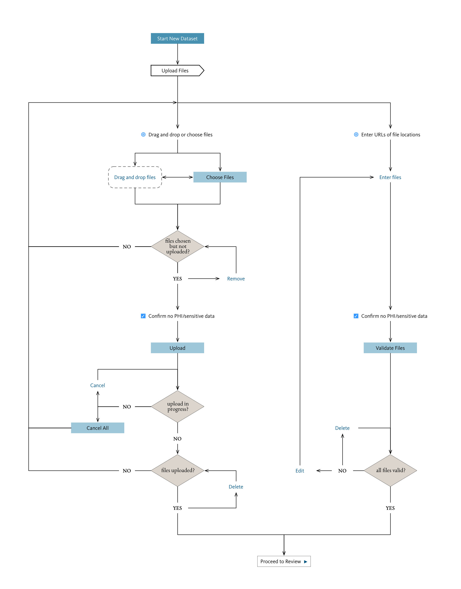

Test cases for file uploads.

## Creating new datasets

- [New dataset with local files](new-dataset-local-files.md)
- [New dataset with URL manifest](new-dataset-manifest.md)

Workflow ([PDF version here](new-dataset-workflow.pdf)):

## Updating existing datasets

- [Updating a dataset with local files](updated-dataset-local-files.md)
- [Updating a dataset with a URL manifest](updated-dataset-manifest.md)

